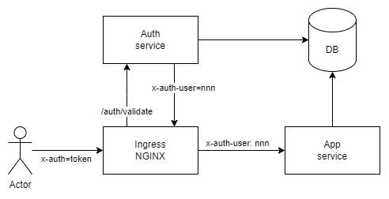

# App with auth via API gateway

## Architecture

* `auth` service generates JWT token with user_id based on login and password
* ingress-nginx validates all inbound requests via `auth` service using JWT token in `x-auth` header
* `app` service uses `x-auth-user` as user id information

## Helm-chart

Chart [helm-otus-21](helm-otus-21) contains:

- app-21 - web UI and API
- auth-21 - JWT token validator
- mariadb as subchart

### Deploy

`helm upgrade -i -n app --create-namespace otus-21 helm-otus-21`

## Postman

[otus-21.postman_collection.json](otus-21.postman_collection.json)

How to run newman from docker:

`docker run -v .:/app --add-host arch.homework=host-gateway postman/newman run --verbose /app/otus-21.postman_collection.json`
